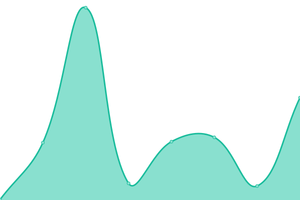

# [📈 Live Status](https://url.tldr.plus): <!--live status--> **🟩 All systems operational**

This repository contains the open-source uptime monitor and status page for [baddate](https://url.tldr.plus), powered by [Upptime](https://github.com/upptime/upptime).

With [Upptime](https://upptime.js.org), you can get your own unlimited and free uptime monitor and status page, powered entirely by a GitHub repository. We use [Issues](https://github.com/baddate/upptime-monitor/issues) as incident reports, [Actions](https://github.com/baddate/upptime-monitor/actions) as uptime monitors, and [Pages](https://url.tldr.plus) for the status page.

<!--start: status pages-->
<!-- This summary is generated by Upptime (https://github.com/upptime/upptime) -->
<!-- Do not edit this manually, your changes will be overwritten -->
<!-- prettier-ignore -->
| URL | Status | History | Response Time | Uptime |
| --- | ------ | ------- | ------------- | ------ |
|  [My Blog](https://smj.im) | 🟩 Up | [my-blog.yml](https://github.com/baddate/uptime-monitor/commits/HEAD/history/my-blog.yml) | 

 223ms
     
 | 

<a href="https://url.tldr.plus/history/my-blog">0.00%</a>
    

|  [Hacker News](https://news.ycombinator.com) | 🟩 Up | [hacker-news.yml](https://github.com/baddate/uptime-monitor/commits/HEAD/history/hacker-news.yml) | 

 406ms
     
 | 

<a href="https://url.tldr.plus/history/hacker-news">0.00%</a>
    

|  [Arch Linux](https://archlinux.org) | 🟩 Up | [arch-linux.yml](https://github.com/baddate/uptime-monitor/commits/HEAD/history/arch-linux.yml) | 

 745ms
     
 | 

<a href="https://url.tldr.plus/history/arch-linux">0.00%</a>
    

|  [Wikipedia](https://en.wikipedia.org) | 🟩 Up | [wikipedia.yml](https://github.com/baddate/uptime-monitor/commits/HEAD/history/wikipedia.yml) | 

 198ms
     
 | 

<a href="https://url.tldr.plus/history/wikipedia">100.00%</a>
    

|  [Stack Overflow](https://stackoverflow.com) | 🟩 Up | [stack-overflow.yml](https://github.com/baddate/uptime-monitor/commits/HEAD/history/stack-overflow.yml) | 

 111ms
     
 | 

<a href="https://url.tldr.plus/history/stack-overflow">0.00%</a>
    

<!--end: status pages-->

[**Visit our status website →**](https://url.tldr.plus)

## 📄 License

- Powered by: [Upptime](https://github.com/upptime/upptime)
- Code: [MIT](./LICENSE) © [baddate](https://url.tldr.plus)
- Data in the `./history` directory: [Open Database License](https://opendatacommons.org/licenses/odbl/1-0/)
