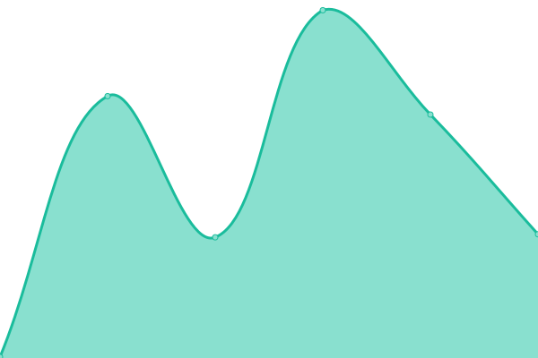

# [📈 Live Status](https://url.johan.zone): <!--live status--> **🟩 All systems operational**

This repository contains the open-source uptime monitor and status page for [baddate](https://url.johan.zone), powered by [Upptime](https://github.com/upptime/upptime).

With [Upptime](https://upptime.js.org), you can get your own unlimited and free uptime monitor and status page, powered entirely by a GitHub repository. We use [Issues](https://github.com/baddate/upptime-monitor/issues) as incident reports, [Actions](https://github.com/baddate/upptime-monitor/actions) as uptime monitors, and [Pages](https://url.johan.zone) for the status page.

<!--start: status pages-->
<!-- This summary is generated by Upptime (https://github.com/upptime/upptime) -->
<!-- Do not edit this manually, your changes will be overwritten -->

| URL                                         | Status | History                                                                                             | Response Time                                                                    | Uptime                                                                                                                                                                                                                |
| ------------------------------------------- | ------ | --------------------------------------------------------------------------------------------------- | -------------------------------------------------------------------------------- | --------------------------------------------------------------------------------------------------------------------------------------------------------------------------------------------------------------------- |
| [My Blog](https://blog.johan.zone)          | 🟩 Up  | [my-blog.yml](https://github.com/baddate/uptime-monitor/commits/master/history/my-blog.yml)         |  238ms     |          |
| [Google](https://www.google.com)            | 🟩 Up  | [google.yml](https://github.com/baddate/uptime-monitor/commits/master/history/google.yml)           |  59ms       |            |
| [Wikipedia](https://en.wikipedia.org)       | 🟩 Up  | [wikipedia.yml](https://github.com/baddate/uptime-monitor/commits/master/history/wikipedia.yml)     |  78ms    |      |
| [Hacker News](https://news.ycombinator.com) | 🟩 Up  | [hacker-news.yml](https://github.com/baddate/uptime-monitor/commits/master/history/hacker-news.yml) |  342ms |  |

<!--end: status pages-->

[**Visit our status website →**](https://url.johan.zone)

## 📄 License

- Powered by: [Upptime](https://github.com/upptime/upptime)
- Code: [MIT](./LICENSE) © [baddate](https://url.johan.zone)
- Data in the `./history` directory: [Open Database License](https://opendatacommons.org/licenses/odbl/1-0/)
